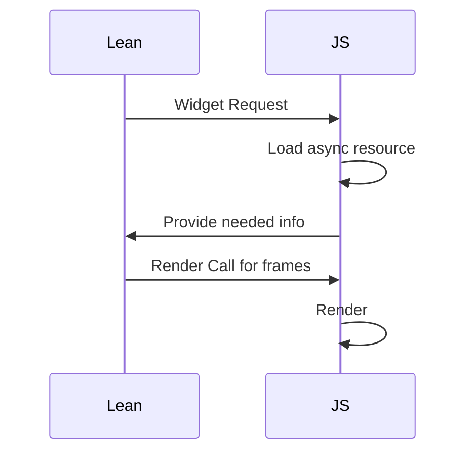

# 关于开源协议

本项目的开源协议尚未决定，由于项目正处在初期开发中，暂时请勿引用本项目 或 用于商业项目，本Repo的所有代码仅可用作学习参考。

# Work In Progress

尝试使用[lean4](https://lean-lang.org/)构建一个动画引擎。

首次尝试计划使用[Lean Widget](https://lean-lang.org/lean4/doc/examples/widgets.lean.html) 完成和js的互通

除此以外的备选方案还有：

* 不使用JS，Lean和C互通，调用OpenGL完成渲染
* 使用emscripten将Lean构建到web完成Lean和JS的互通
* 使用NW.js或其他嵌入C++方案作为bridge完成Lean和JS的互通

# Lean Widget方案

在Lean中完成所有动画和形状的计算，最终生成一份每一帧的向量数据，JS通过RPC取得数据并进行渲染

一个潜在的困难是 计算中依赖的第三方库，如LateX、OpenType等，在JS中引入会更为容易，这一点也许可以在JS中加载然后将信息提供给RPC来完成。

> 经过试验，以上流程确实可以完成，但是存在限制：有时候会存在根据不同条件加载不同资源的场景，无法保证一次交互的信息足够完备。
> 在Lean侧，可以利用RpcSession中包含的Store来

- [x] JS构建和加载流程
- [ ] Lean Widget基础定义
- [ ] 2D Canvas渲染器
    - [ ] Renderer实现和简单图元渲染：点、线
    - [ ] 图片渲染
    - [ ] 字体渲染
    - [ ] LateX排版
    - [ ] 视频输出
- [ ] WebGL 渲染器：当Canvas渲染器跑通流程后再进行实现
- [ ] 音频嵌入、语音合成
- [ ] 视频输出
